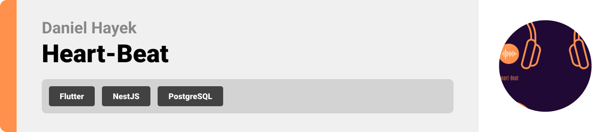

  

<!-- project overview -->

> Heart-Beat is an application that is your companion for all things mood and music.
> The main goal of Heart-Beat is to aid in you figuring out how you feel through various means,
> and then provide you with an appropriate playlist to listen to.

  

<!-- System Design -->

### System Design
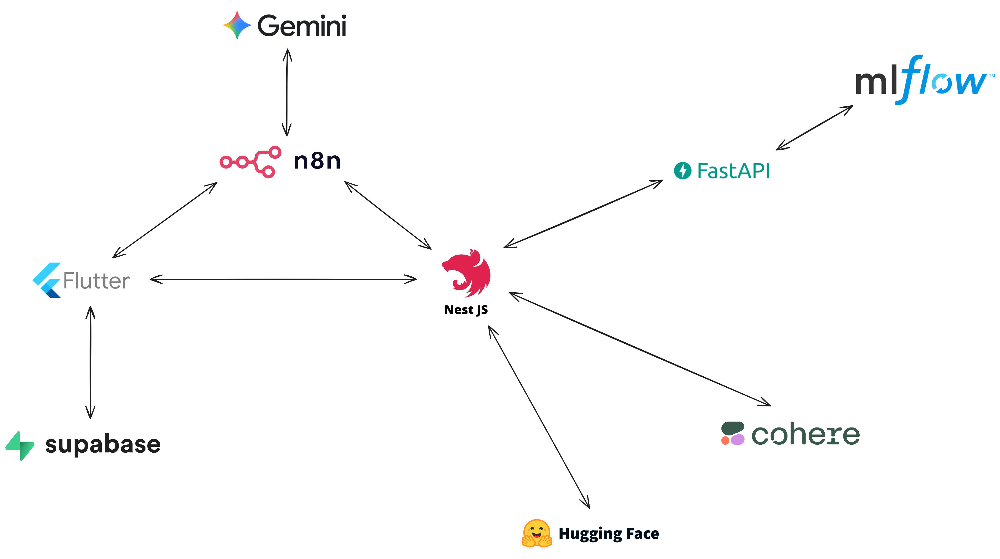

### ERD
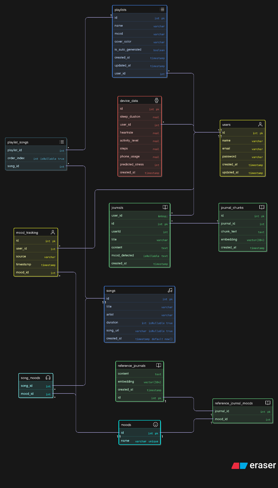

### n8n
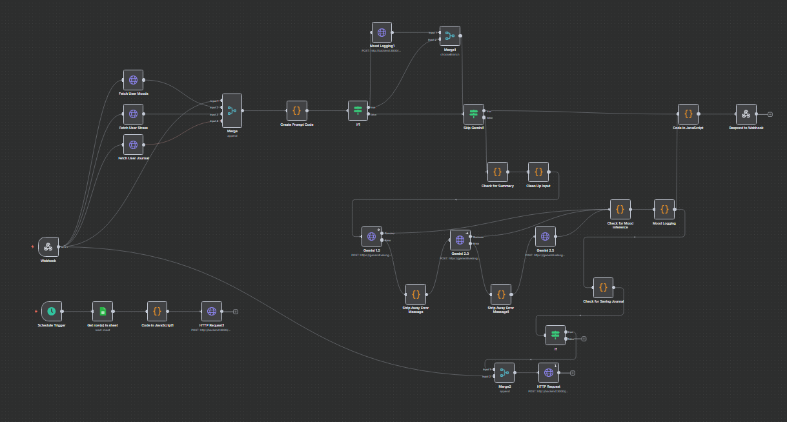

  

<!-- Project Highlights -->

### Interesting Features

- Journalling based mood detection: Analyzes your journals through chunking, embedding and comparing to existing vectors to assign the closest similar set of moods.
- Stress Prediction: Includes a machine learning model that is trained on smartwatch data like heartrate, sleep duration and physical activity, then based on these factors the app predicts your stress level on a scale of 1-10.
- Moody Blues (AI Agent): An AI agent who you can speak and interact with, and who can help log your mood or summarize your thoughts into a journal.

  

<!-- Demo -->

### User Screens

| Landing | Login | Register |
| --------------------------------------- | ------------------------------------- | ------------------------------------- |
| 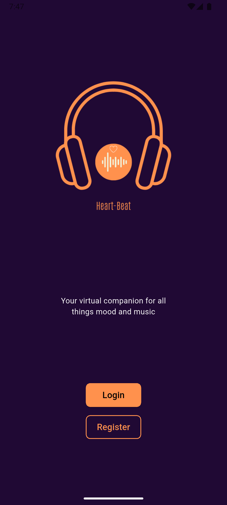 |  |  |

| Home Page (Empty) | Home Page (Full) | Device Data |
| --------------------------------------- | ------------------------------------- | ------------------------------------- |
| 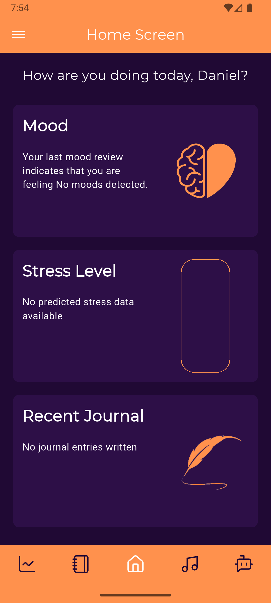 | 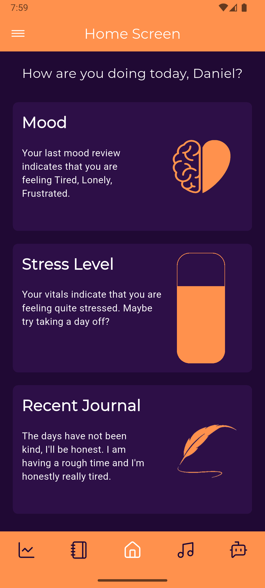 |  |

| Journal Prompts | Write Journal | Journal Entries |
| --------------------------------------- | ------------------------------------- | ------------------------------------- |
| 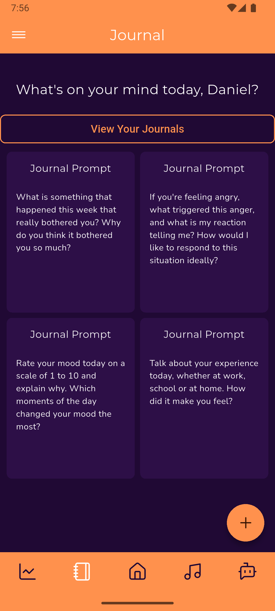 |  | 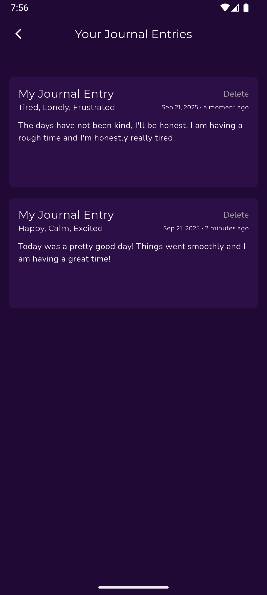 |

| Playlist | Music | Moody Blues |
| --------------------------------------- | ------------------------------------- | ------------------------------------- |
|  |  |  |

  

<!-- Development & Testing -->

### Add Title Here

| CI/CD                             | Testing                        |
| ---------------------------------------  | ------------------------------------- |
| 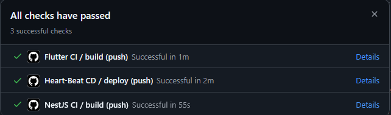 | 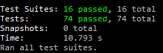 |

  

<!-- Machine Learning Docs -->

### Machine Learning Docs (MLFlow)

| Model Details                            | Model Results                       |
| --------------------------------------- | ------------------------------------- |
| 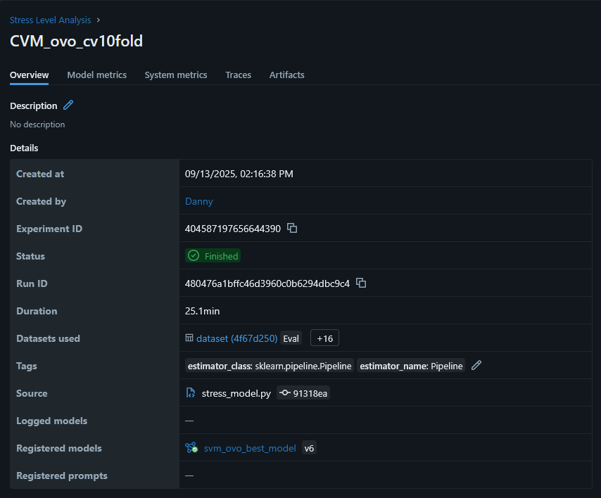 | 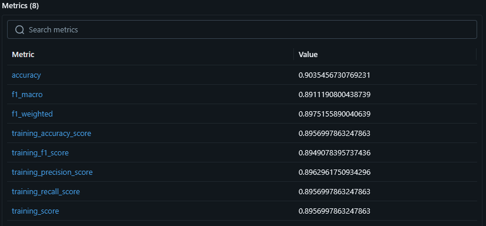 |

  

<!-- Deployment -->

### Add Title Here

- Description here.

| Postman API 1                            | Postman API 2                       | Postman API 3                        |
| --------------------------------------- | ------------------------------------- | ------------------------------------- |
|  |  |  |

  

<!-- Extras -->

### Linear and Swagger

- Utilized Linear for task and branch management.
- Utilized Swagger for API documentation.

| Linear                            | Swagger                       |
| --------------------------------------- | ------------------------------------- |
| 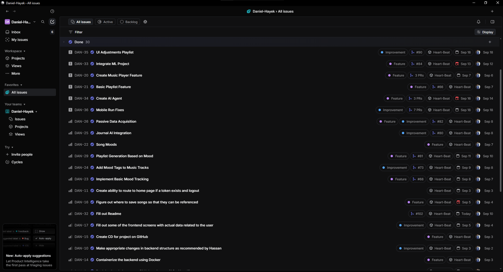 | 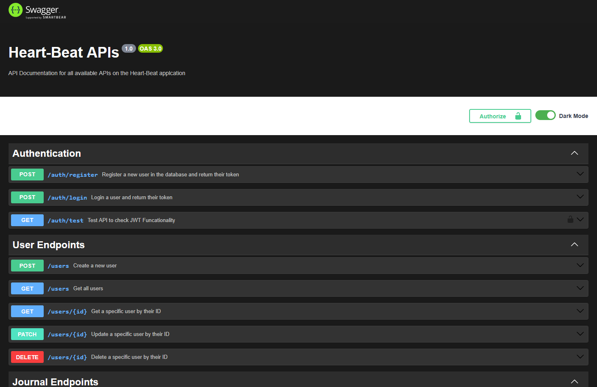 |

  

<!-- Music Attribution -->

# Music Attribution

This project uses the following Creative Commons licensed music tracks:

| Track Title | Artist | Source | License |
|-------------|---------|---------|---------|
| Vibing Over Venus | Kevin MacLeod | [incompetech.com](https://incompetech.com) | [CC BY 4.0](http://creativecommons.org/licenses/by/4.0/) |
| SCP-x5x (Outer Thoughts) | Kevin MacLeod | [incompetech.com](https://incompetech.com) | [CC BY 4.0](http://creativecommons.org/licenses/by/4.0/) |
| Man Down | Kevin MacLeod | [incompetech.com](https://incompetech.com) | [CC BY 4.0](http://creativecommons.org/licenses/by/4.0/) |
| Heart of Nowhere | Kevin MacLeod | [incompetech.com](https://incompetech.com) | [CC BY 4.0](http://creativecommons.org/licenses/by/4.0/) |
| Rains Will Fall | Kevin MacLeod | [incompetech.com](https://incompetech.com) | [CC BY 4.0](http://creativecommons.org/licenses/by/4.0/) |
| Heartbreaking | Kevin MacLeod | [incompetech.com](https://incompetech.com) | [CC BY 4.0](http://creativecommons.org/licenses/by/4.0/) |
| Rumination | Kevin MacLeod | [incompetech.com](https://incompetech.com) | [CC BY 4.0](http://creativecommons.org/licenses/by/4.0/) |
| Late Night Radio | Kevin MacLeod | [incompetech.com](https://incompetech.com) | [CC BY 4.0](http://creativecommons.org/licenses/by/4.0/) |
| Bittersweet | Kevin MacLeod | [incompetech.com](https://incompetech.com) | [CC BY 4.0](http://creativecommons.org/licenses/by/4.0/) |
| Floating Cities | Kevin MacLeod | [incompetech.com](https://incompetech.com) | [CC BY 4.0](http://creativecommons.org/licenses/by/4.0/) |
| Despair and Triumph | Kevin MacLeod | [incompetech.com](https://incompetech.com) | [CC BY 4.0](http://creativecommons.org/licenses/by/4.0/) |
| Private Reflection | Kevin MacLeod | [incompetech.com](https://incompetech.com) | [CC BY 4.0](http://creativecommons.org/licenses/by/4.0/) |
| Dark Ambient | YuraSoop | [freemusicarchive.org](https://freemusicarchive.org) | [CC BY-NC 4.0](https://creativecommons.org/licenses/by-nc/4.0/) |
| Uplifting Ukulele | Waveloom | [freemusicarchive.org](https://freemusicarchive.org) | [CC BY-ND 4.0](https://creativecommons.org/licenses/by-nd/4.0/) |
| Blooming Poison | Joint C Beat Laboratory | [freemusicarchive.org](https://freemusicarchive.org) | [CC BY-NC 4.0](https://creativecommons.org/licenses/by-nc/4.0/) |
| Water World | E-Prosounds | [freemusicarchive.org](https://freemusicarchive.org) | [CC BY-NC-ND 3.0 US](https://creativecommons.org/licenses/by-nc-nd/3.0/us/) |
| Chi Go Getters | Dollar Boyz | [freemusicarchive.org](https://freemusicarchive.org) | [CC BY-NC-SA](https://creativecommons.org/licenses/by-nc-sa/4.0/) |
| Missed The Free Throw | E-Prosounds | [freemusicarchive.org](https://freemusicarchive.org) | [CC BY-NC-ND 3.0 US](https://creativecommons.org/licenses/by-nc-nd/3.0/us/) |
| Boulevard St Germain | Jahzzar | [freemusicarchive.org](https://freemusicarchive.org) | [CC BY-SA 3.0](https://creativecommons.org/licenses/by-sa/3.0/) |
| Shasha | Albert Beger | [freemusicarchive.org](https://freemusicarchive.org) | [CC BY-NC-ND 3.0](https://creativecommons.org/licenses/by-nc-nd/3.0/) |
| Old Times pell | AirFlow | [ccmixter.org](https://ccmixter.org) | [CC BY 4.0](https://creativecommons.org/licenses/by/4.0/) |

## License Information

- **CC BY**: Attribution required
- **CC BY-NC**: Attribution required, Non-commercial use only
- **CC BY-SA**: Attribution required, Share-alike (derivative works must use same license)
- **CC BY-ND**: Attribution required, No derivatives allowed
- **CC BY-NC-SA**: Attribution required, Non-commercial use only, Share-alike
- **CC BY-NC-ND**: Attribution required, Non-commercial use only, No derivatives allowed

All tracks are used in accordance with their respective Creative Commons licenses.

  
