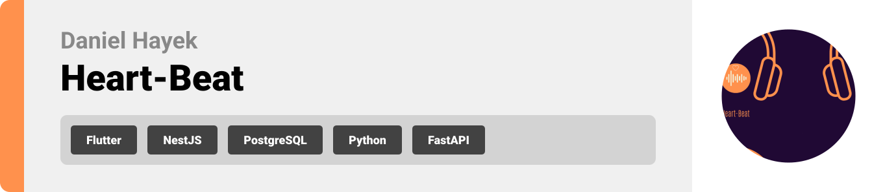

  

<!-- project overview -->

> Heart-Beat is an application that is your companion for all things mood and music.
> The main goal of Heart-Beat is to aid in you figuring out how you feel through various means,
> and then provide you with an appropriate playlist to listen to.

  

<!-- System Design -->

### Add Title Here

- To be decided on later on.

  

<!-- Project Highlights -->

### Interesting Features

- Journalling based mood detection: Analyzes your journals through chunking, embedding and comparing to existing vectors to assign the closest similar set of moods.
- Stress Prediction: Includes a machine learning model that is trained on smartwatch data like heartrate, sleep duration and physical activity, then based on these factors the app predicts your stress level on a scale of 1-10.
- Moody Blues (AI Agent): An AI agent who you can speak and interact with, and who can help log your mood or summarize your thoughts into a journal.

  

<!-- Demo -->

### User Screens (Mobile)

| Login screen                            | Register screen                       | Register screen                       |
| --------------------------------------- | ------------------------------------- | ------------------------------------- |
|  |  |  |

### Admin Screens (Web)

| Login screen                            | Register screen                       |
| --------------------------------------- | ------------------------------------- |
|  |  |

  

<!-- Development & Testing -->

### Add Title Here

| Services                            | Validation                       | Testing                        |
| --------------------------------------- | ------------------------------------- | ------------------------------------- |
|  |  |  |

  

<!-- Deployment -->

### Add Title Here

- Description here.

| Postman API 1                            | Postman API 2                       | Postman API 3                        |
| --------------------------------------- | ------------------------------------- | ------------------------------------- |
|  |  |  |

  
